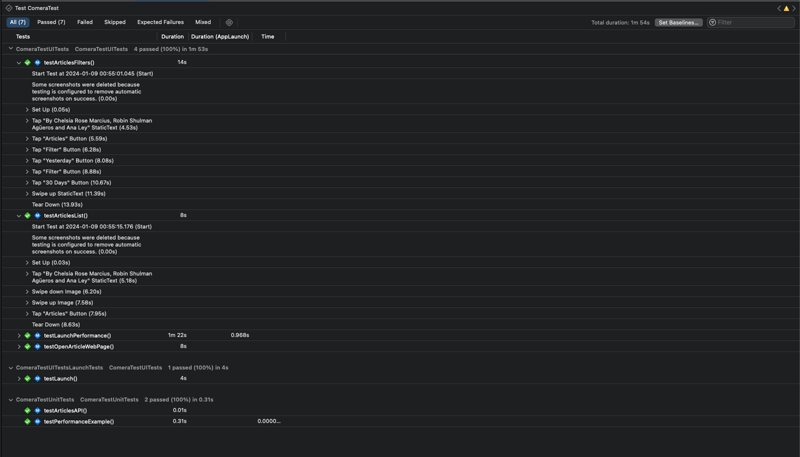

# Comera Assignment: iOS SwiftUI Application

Comera iOS application task as mentioned in memtioned in mail.

## Table of Contents

1. [Environment Dependencies](#environment-dependencies)
2. [Project Setup](#project-setup)
3. [Tests & Code Coverage](#tests--code-coverage)
4. [Notes](#notes)
5. [Sample View](#sample-view)

## Environment Dependencies

- Xcode 14+
- iOS 16+
- SwiftUI
- Swift Package Manager(SPM) Dependencies

## Project Setup

1. Checkout or download Zip.
2. Unzip it and run on `Xcode 14.3` atleast

## Tests & Code Coverage

There are two test files

1. `ComeraTestUnitTests.swift`
2. `ComeraTestUITests.swift`

Run `cmd + U` to run all test.

Code Coverage Reports

## Notes

1. Created a master detail SwftUI application with days filter.
2. Added network layer as swift package `NetworkService`.
3. `Home` will have list of articles with filter that you can change to `Yesterday`, `Last Week` and `Last Month`.
4. `ArticleDetails` will show article details and you can navigate to web page as well.
5. Basic `MVVM Architecture` is used with the help of `Combine` framework.

## Sample View

